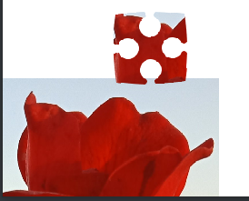

# 图片工具


## 显示轮廓


- gray.vert

  ```
  #ifdef GL_ES
  precision mediump float;
  #endif
  
  
  //input from vertex shader
  varying vec4 v_color;
  varying vec2 v_textCoords;
  uniform sampler2D u_texture;
  
  
  void main() {
      vec4 tempColor = v_color* texture2D(u_texture,v_textCoords);
      if(tempColor.a>0.01){
          tempColor.r = 0.765;
          tempColor.g = 0.733;
          tempColor.b = 0.733;
          tempColor.a = v_color.a;
      }else{
  
      }
      gl_FragColor = tempColor;
  }
  ```

- gray.frag

  ```
  attribute vec4 a_position;
  attribute vec4 a_color;
  attribute vec2 a_texCoord0;
  varying vec4 v_color;
  uniform mat4 u_projTrans;
  varying vec2 v_textCoords;
  
  
  
  void main() {
     v_color = a_color;
     v_color.a = v_color.a * (255.0/254.0);
     v_textCoords = a_texCoord0;
     gl_Position = u_projTrans * a_position;
  }
  ```

- 代码

  ```
  public class ShowGray extends Group {
      private ShaderProgram program;
      public ShowGray(){
          program = new ShaderProgram(
                  Gdx.files.internal("shader/gray.vert"),
                  Gdx.files.internal("shader/gray.frag"));
  
          Image image = new Image(new Texture("0000.png"));
          addActor(image);
      }
  
      @Override
      public void draw(Batch batch, float parentAlpha) {
          batch.setShader(program);
          super.draw(batch,parentAlpha);
          batch.setShader(null);
      }
  }
  ```

## 效果


## 绘制多边形

```
public class PolyShowShape extends Group {
    float[] vertices;
    TextureRegion region = new TextureRegion(new Texture("1.jpg"));
    PolygonSpriteBatch polygonSpriteBatch;
    PolygonSprite sprite;
    PolygonRegion PolygonRegion = null;
    private int idx = 0;
    short tri [];
    public PolyShowShape(){
        x = 0;
        y = 0;
        vertices = new float[2000];
        int idx = this.idx;

        for (float i = 0; i <= 360; i=i+0.5F) {
            vertices[idx ++] = (float) (100+ 100*Math.sin(i));
            vertices[idx ++] = (float) (100+ 100*Math.cos(i));
        }
        vertices[idx++] = 100;
        vertices[idx++] = 100;
        tri = new short[1200];
        for (int i = 0; i < 360; i++) {
            tri[3*i] = 360;
            tri[3*i+1] = (short) i;
            tri[3*i+2] = (short) (i+1);
        }

        PolygonRegion = new PolygonRegion(region,vertices,tri);
        sprite = new PolygonSprite(PolygonRegion);
//        Image image = new Image(new TextureRegion(sprite));
//        addActor();
        polygonSpriteBatch = new PolygonSpriteBatch();
        sprite.setPosition(100,100);
    }

    public void draw(Batch batch, float parentAlpha) {
        polygonSpriteBatch.begin();
        sprite.draw(polygonSpriteBatch);
        polygonSpriteBatch.end();
    }
}
```


### 效果


## 根据摸具抠图，可以使用在拼图游戏中


### vert

```
attribute vec4 a_position;
attribute vec4 a_color;
attribute vec2 a_texCoord0;
varying vec4 v_color;
uniform mat4 u_projTrans;
varying vec2 v_textCoords;


void main() {
   v_color = a_color;
   v_color.a = v_color.a;
   v_textCoords = a_texCoord0;
   gl_Position = u_projTrans * a_position;
}
```

frag

```
#ifdef GL_ES
precision mediump float;
#endif


//input from vertex shader
varying vec4 v_color;
varying vec2 v_textCoords;
uniform sampler2D u_texture;
uniform sampler2D u_texture2;
varying vec2 v_textCoords2;
uniform float u_origin_begin_u;
uniform float u_origin_begin_v;
uniform float u_scale;
uniform float v_scale;


void main() {
    vec4 tempColor;
    vec2 v_textCoords2 = vec2((v_textCoords.x)/u_scale,(v_textCoords.y)/v_scale);
    if(v_textCoords2.x>1.0 || v_textCoords2.y>1.0 || v_textCoords2.x<0.0 || v_textCoords2.y<0.0){
        tempColor = vec4(0.0,0.0,0.0,0.0);
    }else{
        tempColor = texture2D(u_texture2,v_textCoords2);
    }
   vec4 color = v_color* texture2D(u_texture, v_textCoords);
   gl_FragColor = color;
   gl_FragColor.a = color.a* tempColor.a;
}
```

### 代码

```
package com.demo.demo;

import com.badlogic.gdx.Gdx;
import com.badlogic.gdx.Input;
import com.badlogic.gdx.graphics.GL20;
import com.badlogic.gdx.graphics.Texture;
import com.badlogic.gdx.graphics.g2d.Batch;
import com.badlogic.gdx.graphics.g2d.TextureRegion;
import com.badlogic.gdx.graphics.glutils.ShaderProgram;
import com.badlogic.gdx.scenes.scene2d.Group;

/**
 * 从图片中扣出一块区域
 */
public class Kouchu extends Group {
    Texture other;
    TextureRegion region;
    float xx = 0;
    private ShaderProgram shader;
    public Kouchu(){
        shader = new ShaderProgram(
                Gdx.files.internal("shader/circle.vert"),
                Gdx.files.internal("shader/circle.frag"));
        other =new Texture("0000.png");
        setSize(720,1280);  //white_circle
        region = new TextureRegion( new Texture("1.png"));
    }

    @Override
    public void act(float delta) {
        super.act(delta);
        if (Gdx.input.isKeyPressed(Input.Keys.LEFT)){
            xx -= 0.1F;
        }
        if (Gdx.input.isKeyPressed(Input.Keys.RIGHT)){
            xx += 0.1F;
        }
    }

    @Override
    public void draw(Batch batch, float parentAlpha) {
        shader.begin();
        Gdx.gl.glActiveTexture(GL20.GL_TEXTURE1);
        other.bind();
        shader.setUniformi("u_texture2",1);
        shader.setUniformf("u_scale",0.56F+xx);
        shader.setUniformf("v_scale",1+xx);
        Gdx.gl.glActiveTexture(GL20.GL_TEXTURE0);
        region.getTexture().bind();
        shader.setUniformMatrix("u_projTrans",batch.getProjectionMatrix());
        batch.draw(region,getX(),getY(),originX,originY,region.getRegionWidth(),
                region.getRegionHeight(),0.95F*getScaleX(),0.95F*getScaleY(),1);
        batch.flush();
        shader.end();
    }
}
```

### 效果




